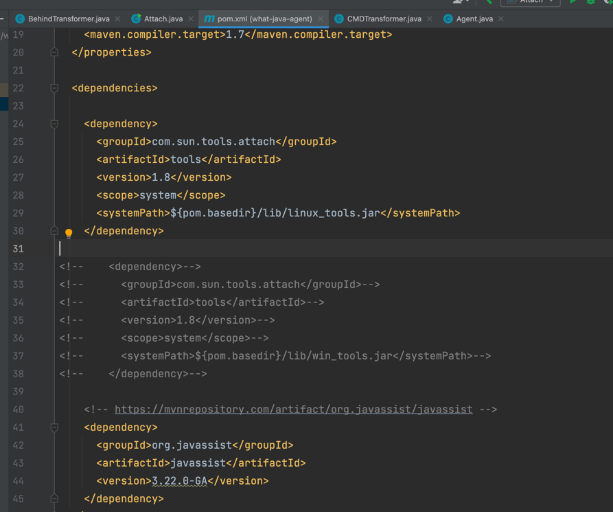

# what-java-agent-final

该工程用于能够落地进行java-agent内存马注入，但是在一些只有jre的环境下必须通过打包tools.jar包来进行java-agent内存马的注入。

环境的tools.jar打包自行切换



# manifest
MANIFEST.MF

```
Manifest-Version: 1.0
Main-Class: com.zpchcbd.mem.Attach
Agent-Class: com.zpchcbd.mem.Agent
Can-Redefine-Classes: true
Can-Retransform-Classes: true
```

# 用法

## list jvm

`java -jar what-java-agent-final.jar print");`

## 注入filter内存马到指定的pid的jvm

`java -jar what-java-agent-final.jar inject 8`

